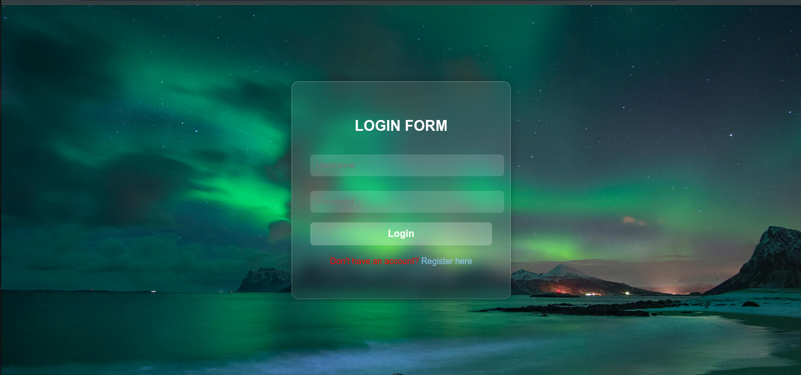
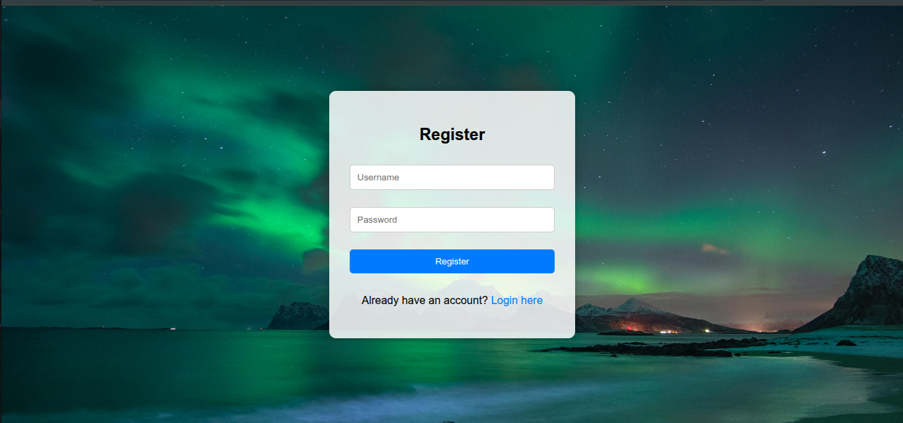
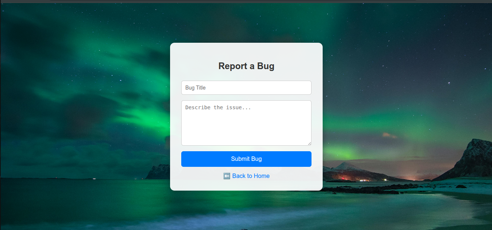
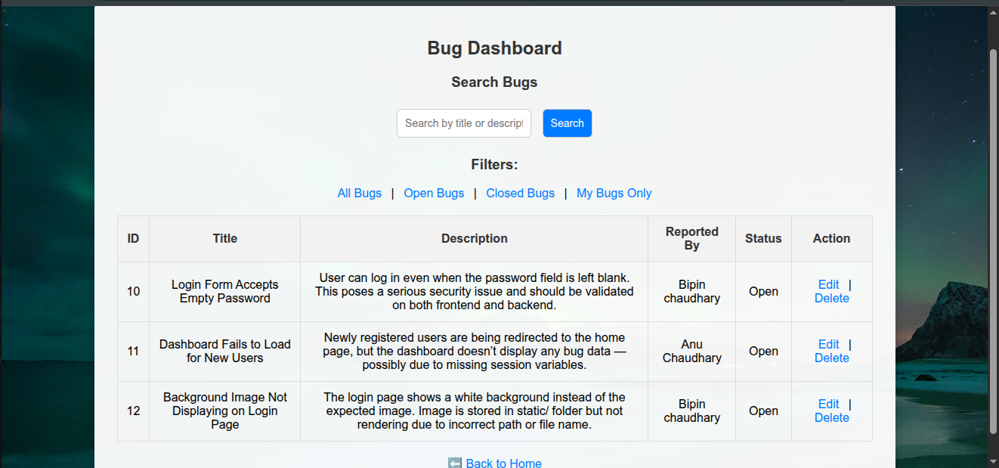
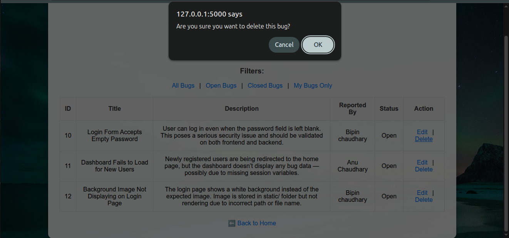

.# 🔧 Bug Tracker Web App

A simple and beautiful bug tracking system built using Flask. This web app allows users to register, log in, report bugs, and manage them using an intuitive dashboard interface.

---

## 🌐 Live Screenshots

| Login | Register | Home |
| ----- | -------- | ---- |
|  |  |  |

| Report Bug | Dashboard | Delete Confirmation |
| ---------- | --------- | ------------------- |
|  |  |  |

---

## 📚 Features

- ✅ User registration and login system
- 🔐 Secure session-based access control
- 🐞 Bug submission with title and description
- 📋 Dashboard to view all bugs
- 🔍 Search and filter bugs
- ✏️ Edit & 🗑️ Delete functionality
- 💎 Clean UI with glassmorphism design

---

## ⚙️ Installation Guide

### 📥 Step 1: Clone the repository

```bash
git clone https://github.com/yourusername/bug-tracker.git
cd bug-tracker```
```
### 🧰 Step 2: Set up virtual environment

```bash

`python3 -m venv venv source venv/bin/activate # For Linux/macOS  # OR venv\Scripts\activate # For Windows` 
```
### 📦 Step 3: Install dependencies

```bash
`pip install -r requirements.txt` 
```
### 🚀 Step 4: Run the application

```bash

`python app.py` 
```
Now, open your browser and visit:  
`http://127.0.0.1:5000`

----------

----------

## 📁 Folder Structure

arduino
```

`bug-tracker/
├── app.py
├── database.db
├── requirements.txt
├── README.md
├── static/
│   ├── style.css
│   └── background.jpg
├── templates/
│   ├── login.html
│   ├── register.html
│   ├── dashboard.html
│   ├── report.html
│   └── home.html
└── screenshots/
    ├── login.png
    ├── register.png
    ├── home.png
    ├── report.png
    ├── dashboard.png
    └── delete.png` 
```
----------

## 🛠️ Tech Stack

-   **Backend:** Flask (Python)
    
-   **Frontend:** HTML, CSS
    
-   **Design:** Glassmorphism
    
-   **Database:** SQLite (via `sqlite3`)
    
-   **Icons:** Emojis + Bootstrap Icons
    

----------

## 🧑‍💻 Author

**Anu Chaudhary**  
📧 anuchaudhary23107@gmail.com  
📚 Engineering Student – CSE (AIML)

----------

## 📜 License

This project is licensed under the MIT License.

----------

## 🙌 Acknowledgments

-   Flask documentation
    
-   UI inspiration from Dribbble glassmorphism concepts
    
-   GitHub Copilot for snippet generation
    
